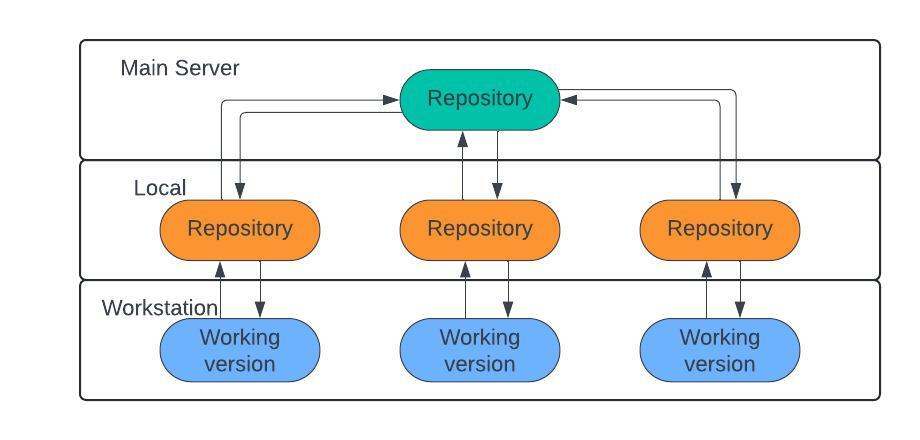

# Git and Version Control
## What is version control?
Version control is the practice of tracking and managing changes to a project. It's a crucial concept in software 
engineering, helping teams to collaborate effectively and provide quality assurance.

Version control systems are software tools that allow engineering teams to manage changes to a code repository over 
time. These tools keep track of every modification to the repository. If a mistake is made, developers can revert back
to a previous version, fixing the mistake with minimal disruption and a clear idea of the state of the application at
the point they are reverting back to.

### How version control works
Version control tools allow developers to take snapshots of a code base, capturing a point in time. Different version 
control systems do this in slightly different ways, but the result is the same - the development team have a way to 
track, describe and review any changes made during the life of project.

### Facilitating collaboration
In addition to recording changes, version control is a powerful enabler of collaboration. Development teams will
continually be writing new code and changing existing source code. One developer on the team may be working on a new 
feature while another developer fixes an unrelated bug by changing code, each developer may make their changes in 
several parts of the file tree.

Tracking every change by each contributor helps prevent concurrent work from conflicting. Furthermore, allowing 
developers to build on a static snapshot, rather than a constantly shifting codebase, ensures compatibility.

## What is git?
Git is the most popular version control tool for software development. Unlike previous version control systems, Git 
thinks of its data more like a series of snapshots of a miniature filesystem. With Git, every time you commit, or save 
the state of your project, Git basically takes a picture of what all your files look like at that moment and stores a 
reference to that snapshot. To be efficient, if files have not changed, Git doesn’t store the file again, just a link 
to the previous identical file it has already stored. Git thinks about its data more like a stream of snapshots. 

As well as being more efficient, git's approach to version control is more prescriptive - we only track what's changed.

## Git commands
We interact with git through the command line interface, rather than a GUI. This allows us to use git on a wide range 
of different systems, from our desktop to lightweight linux instances in the cloud.

Common git commands are:
- `git init`
- `git add`
- `git status`
- `git commit`
- `git push`
- `git clone`
- `git help`

These commands, and the order they are typically used in, can be understood as the git workflow. This is:
1) `git init` -  Create an empty Git repository or reinitialize an existing one
2) `git status` - Show the working tree status
3) `git add` - Add file contents to the index
4) `git commit` - Record changes to the repository

### Understanding git commit history
We have useful git commands that allow us to view a git project's commit history, as well as compare multiple commits:
- `git log` -  Show commit logs
- `git diff` - Show changes between commits, commit and working tree, etc

## Distributed Version Control

Distributed version control is a system that allows multiple users to collaborate on a codebase by maintaining a copy of
the entire repository locally on their computers. Each user has a complete history of the project, including all files 
and their revisions. This decentralized approach contrasts with centralized version control systems, where there is a 
single central repository that users must connect to in order to access the codebase. In distributed version control, 
users can work offline, make changes, and commit them to their local repository. They can later synchronize their 
changes with others by pushing and pulling changes between repositories.

Distributed version control offers greater flexibility and autonomy to developers
as they can work independently without relying on a central server. This decentralization also enhances collaboration, 
as team members can work in parallel on different branches of the codebase without interfering with each other's work. 
Additionally, distributed version control systems provide robustness and reliability, as each user's local copy serves 
as a backup of the entire project. Furthermore, they facilitate branching and merging, making it easier to experiment 
with new features or fixes without disrupting the main codebase, and then seamlessly integrating these changes when 
they're ready.

### Github

